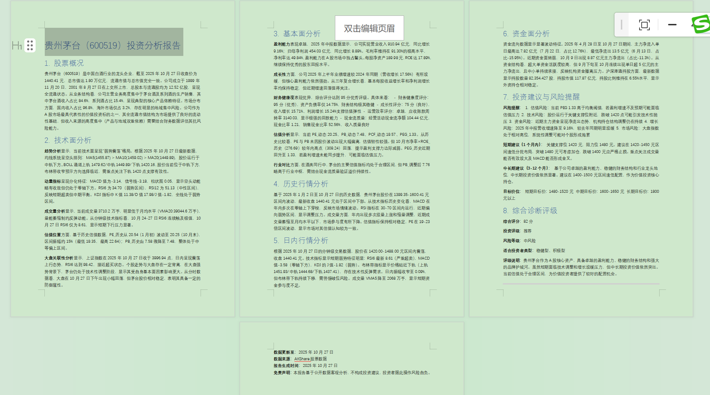

# AKShare 股票数据插件 v0.6.0 - 优化升级版综合性股票数据工具

**发布日期**：2025-10-28  
**标签**：v0.6.0

**下载插件包**：[AKShare-Stockdata-plugin-v0.6.0.difypkg](https://github.com/shaoxing-xie/akshare-stockdata-plugin/releases/tag/v0.6.0)

## 📋 概述

**AKShare 股票数据插件** 是一个专为 Dify 平台开发的综合性股票数据工具，基于知名的 [AKShare](https://github.com/akfamily/akshare) Python 库构建。本插件为用户提供了一站式的股票市场数据访问解决方案，涵盖实时行情、历史数据、财务分析、资金流向、技术分析、沪深港通等多个维度的专业股票信息。v0.6.0版本聚焦于优化插件结构、提升用户体验，并确保与Dify Marketplace的兼容性，准备正式发布到市场。

> **功能亮点**: 提供175个数据接口，覆盖全球股票市场。查看 [完整功能文档](https://github.com/shaoxing-xie/akshare-stockdata-plugin/blob/main/AKShare%20股票数据插件详细功能文档.md) 获取所有接口详情、参数指南和技术参考。

> **重要声明**: 本插件是 AKShare 库的 Dify 平台集成工具，AKShare 是一个专为学术研究目的设计的开源金融数据接口库。我们对 AKShare 项目团队的卓越工作表示诚挚感谢。

> **⚠️ 接口更新说明**: 由于网络传输稳定性问题，已移除以下8个股东分析接口：
> - `stock_gdfx_free_holding_analyse_em` - 股东持股分析(十大流通股东)
> - `stock_gdfx_holding_analyse_em` - 股东持股分析(十大股东)
> - `stock_gdfx_free_holding_detail_em` - 股东持股明细(十大流通股东)
> - `stock_gdfx_holding_detail_em` - 股东持股明细(十大股东)
> - `stock_gdfx_free_holding_statistics_em` - 股东持股统计(十大股东)
> - `stock_gdfx_holding_statistics_em` - 股东持股统计(十大股东)
> - `stock_gdfx_free_holding_change_em` - 股东持股变动统计(十大流通股东)
> - `stock_gdfx_holding_change_em` - 股东持股变动统计(十大股东)
> 
> 其他股东相关接口（十大股东等）仍然正常可用。

## 🚀 核心特点

### 💎 **无需API密钥**
- ✅ **零配置使用**: 无需申请任何API密钥或令牌
- ✅ **即插即用**: 安装后立即可用，无需复杂配置
- ✅ **成本节约**: 完全免费使用，无使用次数限制

### 🔧 **版本兼容性**
- ✅ **Dify 0.3.0+**: 完全兼容最新版本Dify
- ✅ **依赖管理**: 使用requirements.txt确保稳定安装
- ✅ **自动依赖**: AKShare自动安装pandas和numpy，无需手动配置

### 🌐 **权威数据源**
- 📊 **东方财富网**: 实时行情、财务数据、市场分析
- 📈 **新浪财经**: 历史行情、股票资讯
- 🏢 **同花顺**: 技术指标、资金流向分析
- 💰 **腾讯财经**: 港股、美股数据
- 📱 **网易财经**: 市场概况、个股信息
- 🔗 **公开API**: 证券交易所官方数据接口

### 🛠️ **强大功能矩阵**
- 🎯 **12个专业工具**: 覆盖股票数据分析的各个方面
  - **11个原始接口工具**: 基于AKShare的原始数据接口
  - **1个扩展指标工具**: 专业的技术指标计算和分析
- 🌍 **175个数据接口**: 广泛覆盖全球主要股票市场
- 📊 **多市场支持**: A股、B股、港股、美股、科创板、北交所
- 🔄 **实时+历史**: 既有实时行情，也有历史数据分析
- 📋 **双重输出**: Markdown表格 + JSON格式，便于阅读和处理
- 📈 **技术分析**: 专业的技术指标计算和分析工具

### 🔧 **技术优势**
- 🛡️ **智能错误处理**: 自动重试机制，优雅的错误恢复
- 🌐 **完整Unicode支持**: 完美处理中文字符和特殊符号
- ⚡ **性能优化**: 子进程隔离，高效内存管理
- 🔄 **参数验证**: 自动参数校验和格式转换

## 👥 服务对象

### 🎓 **学术研究人员**
- 金融学研究者进行市场分析和学术研究
- 经济学学者研究股市波动规律
- 数据科学研究者进行量化分析

### 🤖 **AI应用开发者**
- 构建智能投资助手和财经聊天机器人
- 开发股票分析和预测模型
- 创建自动化投资决策系统

## 📚 详细功能文档

插件提供12个专业工具共175个数据接口的完整功能。查看 [完整功能文档](https://github.com/shaoxing-xie/akshare-stockdata-plugin/blob/main/AKShare%20股票数据插件详细功能文档.md) 获取所有接口详情、参数指南和技术参考。

## 🛠️ 工具详情

### 🏠 **工具一：股票市场总貌**
- **接口数量**: 25个
- **功能**: 获取整体市场概况和统计数据，包括上交所、深交所市场总貌、股权质押、商誉数据、股票账户统计、千股千评、新股申购收益率、停复牌提醒、分红派息等
- **适用场景**: 市场分析、宏观研究、风险监控

### 📊 **工具二：个股信息总貌**
- **接口数量**: 25个
- **功能**: 获取个股基本信息、财务数据、研究报告，包括A股的股票信息、行情报价、主营业务、新闻资讯、分红配股、资产负债表、股东持股分析等
- **适用场景**: 基本面分析、投资研究、价值评估、股东结构分析

### 📈 **工具三：股票实时行情**
- **接口数量**: 15个
- **功能**: 获取各市场实时股票行情数据，包括沪深京A股实时行情，新股数据，AH股比价，AB股比价，次新股数据，两网及退市股票等
- **适用场景**: 实时监控、交易决策、跨市场比较

### 📊 **工具四：股票历史行情**
- **接口数量**: 12个
- **功能**: 获取历史价格数据，包括A股日线和分时数据，科创板历史数据，盘前数据等
- **适用场景**: 技术分析、回测研究、量化建模

### 🌉 **工具五：沪深港通持股**
- **接口数量**: 12个
- **功能**: 北向资金持股和流向数据，包括港股通成份股、沪深港通分时数据、板块排行、个股排行、实时行情、历史数据、具体股票持股、沪深港通资金流向等
- **适用场景**: 外资动向分析、市场情绪、北向资金追踪

### 🌊 **工具六：资金流向分析**
- **接口数量**: 14个
- **功能**: 分析资金流向和市场情绪，包括个股资金流向、板块资金流向排行、主力资金流向、行业和概念历史资金流向、筹码分布等
- **适用场景**: 资金面分析、市场情绪判断、主力动向追踪

### 💰 **工具七：股票财务数据分析**
- **接口数量**: 23个
- **功能**: 获取财务报表和业绩数据，包括A股业绩快报（利润表、现金流量表、资产负债表）、同花顺财务指标、新浪财经财务指标等
- **适用场景**: 财务分析、价值投资、跨市场比较

### 📈 **工具八：股票技术分析**
- **接口数量**: 13个
- **功能**: 技术指标和创新高低数据，包括创新高低、连续上涨下跌、持续放量缩量、均线突破、量价分析、ESG评级等
- **适用场景**: 技术分析、趋势判断、ESG投资

### 📉 **工具九：个股综合技术指标** ⭐ **扩展指标工具**
- **接口数量**: 5个
- **功能**: 基于个股历史数据计算多种技术指标的综合分析工具，支持5种指标类型
- **适用场景**: 技术分析、量化研究、投资决策、学术研究

### 🇭🇰 **工具十：港股数据** ⭐ **独立工具**
- **接口数量**: 14个
- **功能**: 港股相关的数据接口，包括港股实时行情、历史数据、财务分析、公司资料、分红派息等
- **适用场景**: 港股投资分析、跨市场比较

### 🇺🇸 **工具十一：美股数据** ⭐ **独立工具**
- **接口数量**: 8个
- **功能**: 美股相关的数据接口，包括美股实时行情、历史数据、财务分析、知名股票分类等
- **适用场景**: 美股投资分析、全球市场研究

### 📊 **工具十二：股票指数数据** ⭐ **指数分析工具**
- **接口数量**: 9个
- **功能**: A股指数相关的数据接口，包括指数实时行情、历史数据、分时行情、技术指标等
- **适用场景**: 指数分析、市场趋势、技术研究

## 🔄 版本更新亮点（从 v0.5.1 到 v0.6.0）

* **优化插件结构**：清理临时文件、缓存目录，移除不必要依赖，确保插件包精简独立。
* **接口调整**：由于网络传输稳定性问题，移除8个股东分析接口，提升整体稳定性。
* **新增工具**：新增股票指数数据工具（stock_index_data），提供9个指数相关接口。
* **图标升级**：设计并替换新插件图标（_assets/icon.png），提升视觉专业性。
* **文档完善**：统一接口数量为175个，突出详细功能文档链接，便于用户快速了解全面功能。
* **配置更新**：manifest.yaml 和 pyproject.toml 版本升级到0.6.0，修正图标路径和 created_at 时间戳，避免与市场插件冲突。
* **变更日志**：新增 CHANGELOG.md，详细记录 v0.6.0 的添加、变更和修复内容。
* **完全向后兼容**：现有工作流无需修改，即可升级使用。

👉 **详细变更日志** - [完整的版本更新说明](https://github.com/shaoxing-xie/akshare-stockdata-plugin/blob/main/CHANGELOG.md)

## 🎯 演示和示例

### 📋 **Dify 工作流演示**

我们提供了两个完整的 Dify 工作流演示文件，展示了如何使用 AKShare 股票数据插件的各种功能：

#### 🔧 **演示文件一：插件功能演示**
**文件**: `应用示例/AKShare 股票数据插件 CHATFLOW-DEMO.yml`

**功能说明**: 演示插件所有工具及其接口的使用，展示12个专业工具的完整功能

**演示内容**:
- **股票市场总貌** - 展示市场概况数据获取
- **个股信息总貌** - 演示个股详细信息查询
- **股票实时行情** - 实时价格数据获取
- **股票历史行情** - 历史价格数据分析
- **沪深港通持股** - 北向资金持股情况
- **资金流向分析** - 资金流向数据分析
- **股票财务数据分析** - 财务报表数据获取
- **股票技术分析** - 技术指标计算

**演示特色**:
- **智能条件分支** - 根据用户输入自动选择合适的数据接口
- **数据格式转换** - 自动将 Markdown 表格转换为 Excel 文件
- **多维度展示** - 涵盖所有12个专业工具的使用场景
- **完整工作流** - 从数据获取到结果展示的完整流程

#### 🤖 **演示文件二：个股深度分析应用**
**文件**: `应用示例/个股行情分析-ChatFlow.yml`

**功能说明**: 基于AKShare股票数据插件的个股深度分析ChatFlow应用，提供多维度股票分析

**核心功能**:
- **智能股票识别** - 自动识别股票代码和市场类型（沪市A股、深市A股、北交所）
- **历史行情分析** - 基于一年期历史数据的技术面分析
- **财务指标分析** - 基于财务数据的基本面分析
- **资金流向分析** - 基于资金流向的资金面分析
- **个股研报获取** - 获取最新的个股研究报告
- **综合投资建议** - 基于多维度数据的投资建议

**技术特色**:
- **动态日期计算** - 自动计算最新的历史数据时间范围
- **A股市场验证** - 智能识别并验证A股股票代码
- **多数据源整合** - 整合历史行情、财务数据、资金流向、研报等多维度数据
- **专业分析报告** - 生成包含技术面、基本面、资金面的综合分析报告

#### 🎨 **应用示例展示**

##### 📊 个股诊断报告示例

我们基于插件构建了一个完整的个股诊断工作流，可以自动生成专业的个股诊断报告：

##### 🔄 工作流配置

以下是个股诊断助手的工作流配置，展示了如何组合使用多个工具来实现复杂的股票分析：

---

**兼容性**：Dify 0.3.0+  
**依赖**：AKShare 最新版  
**许可证**：MIT License

## 📞 技术支持

* **问题反馈**： [GitHub Issues](https://github.com/shaoxing-xie/akshare-stockdata-plugin/issues)
* **邮箱**： sxxiefg@163.com
* **参考**： [AKShare 官方文档](https://github.com/akfamily/akshare)

感谢您的支持！此版本是向 Dify Marketplace 发布的准备版，欢迎反馈以进一步完善。🚀
