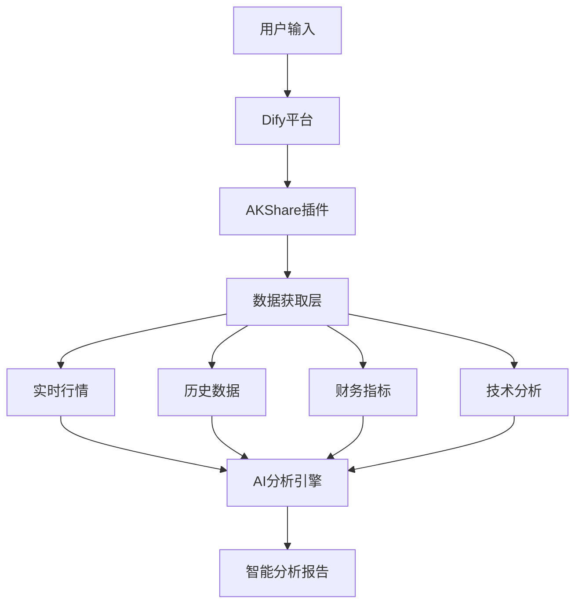

# AI股票分析新利器：零代码搭建专业股票分析系统，113个数据接口免费用！

## 前言

在人工智能与金融科技深度融合的今天，AI驱动的股票分析正成为投资领域的新趋势。然而，对于大多数非金融专业的开发者和投资者来说，获取高质量的股票数据往往是第一道门槛：

### 🚧 **传统方案的痛点**

- 💰 **数据获取成本高昂** - 专业财经数据服务动辄每月几千元，对个人用户来说负担沉重
- 🔧 **技术门槛复杂** - 需要掌握多种API接口、数据处理技术，学习成本高
- 📊 **数据源分散** - 实时行情、财务数据、技术指标分布在不同平台，整合困难
- ⚡ **开发周期长** - 从数据获取到分析系统上线需要数月时间，效率低下
- 🎯 **专业门槛高** - 大多数工具面向专业投资者，普通用户难以理解和使用

### 💡 **AI时代的新机遇**

随着大语言模型（LLM）技术的成熟，我们有了新的可能：
- **自然语言交互** - 用普通话就能查询和分析股票
- **智能数据解读** - AI自动解释复杂的财务指标和技术分析
- **个性化分析** - 根据用户需求生成定制化的投资分析报告
- **零代码实现** - 通过可视化配置就能搭建专业分析系统

### 🎯 **我们的解决方案**

今天为大家介绍一个完全免费、零代码、专为非金融专业人员设计的解决方案 —— **AKShare股票数据插件**。

这个插件的核心理念是：**让任何人都能轻松利用AI技术分析A股市场**，无需金融专业背景，无需编程技能，只需要简单的操作就能获得专业级的股票分析结果。

特别是搭配**Deepseek Reasoner**这样的高级推理模型，能够生成媲美券商研报质量的专业分析报告。

## 🎯 什么是AKShare股票数据插件？

**AKShare股票数据插件**是基于开源项目[AKShare](https://github.com/akfamily/akshare)开发的Dify平台插件，主要服务对象是**非金融专业人员**，包括：

- 👨‍💻 **程序员** - 希望为自己或他人开发股票分析工具
- 📚 **学生** - 学习金融知识和数据分析
- 💼 **普通投资者** - 希望更好地了解投资标的
- 🏢 **小微企业** - 需要股票数据但预算有限

### ✨ 核心优势

| 特性 | 传统方案 | AKShare插件 |
|------|----------|-------------|
| **成本** | 付费API，月费数千元 | 🆓 **完全免费** |
| **技术门槛** | 需要编程基础 | 🚀 **零代码操作** |
| **数据覆盖** | 单一数据源 | 📊 **113个专业接口** |
| **部署时间** | 数周到数月 | ⚡ **快速上手** |
| **目标用户** | 专业投资者 | 🎯 **非专业用户友好** |

### 🏗️ 技术架构



## 📊 113个数据接口，覆盖股票分析全场景

AKShare插件提供8大类共113个专业数据接口，为非专业用户提供全面的股票数据支持：

### 🏠 **工具一：股票市场总貌** (13个接口)
**功能说明**：获取整体市场概况和统计数据
- **市场总貌**：上交所、深交所市场总貌数据
- **风险监控**：股权质押、商誉数据统计
- **市场统计**：股票账户统计、千股千评
- **投资数据**：新股申购收益率、停复牌提醒、分红派息

### 📊 **工具二：股票实时行情** (17个接口)
**功能说明**：获取各市场实时股票行情数据
```json
// 接口调用示例
{
  "interface": "stock_sh_a_spot_em",
  "symbol": "600519"
}
```
**涵盖市场**：
- **A股市场**：沪深京A股实时行情
- **新股数据**：新股申购和上市数据
- **对比分析**：AH股比价数据
- **国际市场**：港股、美股知名股票实时行情

### 📈 **工具三：股票历史行情** (9个接口)
**功能说明**：获取历史价格数据
```json
// 历史数据获取
{
  "interface": "stock_zh_a_hist",
  "symbol": "600519",
  "period": "daily",
  "start_date": "20240101",
  "end_date": "20241231",
  "adjust": "qfq"
}
```
**数据类型**：
- **A股数据**：日线和分时历史数据
- **国际市场**：港股、美股历史数据
- **特色板块**：科创板历史数据
- **盘前数据**：开盘前的交易数据

### 🏢 **工具四：个股信息总貌** (14个接口)
**功能说明**：获取个股基本信息、财务数据、研究报告
- **基本信息**：A股和港股的股票基本信息
- **行情报价**：个股详细行情数据
- **业务分析**：主营业务构成分析
- **公司动态**：新闻资讯、分红配股、资产负债表

### 💰 **工具五：股票财务数据分析** (14个接口)
**功能说明**：获取财务报表和业绩数据
```json
// 财务数据查询
{
  "interface": "stock_financial_abstract_ths",
  "symbol": "600519"
}
```
**数据范围**：
- **A股财务**：业绩快报（利润表、现金流量表、资产负债表）
- **财务指标**：同花顺财务指标体系
- **国际对比**：港股美股财务数据

### 🌊 **工具六：资金流向分析** (11个接口)
**功能说明**：分析资金流向和市场情绪
```json
// 资金流向查询
{
  "interface": "stock_individual_fund_flow",
  "stock_code": "600519",
  "market": "沪深A股"
}
```
**分析维度**：
- **个股资金**：个股资金流向分析
- **板块资金**：板块资金流向排行
- **主力动向**：主力资金流向追踪
- **历史分析**：行业和概念历史资金流向、筹码分布

### 📊 **工具七：股票技术分析** (18个接口)
**功能说明**：技术指标和创新高低数据
- **创新分析**：创新高低、连续上涨下跌统计
- **量价分析**：持续放量缩量、均线突破、量价分析
- **ESG投资**：ESG评级数据
- **价值指标**：个股技术指标、股息率分析

### 🌉 **工具八：沪深港通持股** (7个接口)
**功能说明**：北向资金持股和流向数据
- **成份股**：港股通成份股数据
- **实时数据**：沪深港通分时数据、实时行情
- **排行数据**：板块排行、个股排行
- **持股分析**：历史数据、具体股票持股情况

## 🚀 零代码搭建：快速上手指南

对于非专业用户，我们提供了完整的上手指南，无需任何编程基础即可开始使用：

### 第一步：准备工作

1. **注册Dify账号**
   - 访问 [Dify官网](https://dify.ai) 注册免费账号
   - 创建你的工作空间

2. **安装AKShare插件**
   - 进入工作空间的 **工具** → **插件市场**
   - 搜索 **"AKShare股票数据"**
   - 点击 **安装** 按钮即可

### 第二步：选择演示模板

我们提供了两个现成的工作流模板，可以直接导入使用：

#### 🔧 **模板一：插件功能演示**
**文件名**：`AKShare 股票数据插件 CHATFLOW-DEMO.yml`
- **适合用户**：想了解插件所有功能的用户
- **包含功能**：展示8大类工具的使用方法
- **特色功能**：智能条件分支、自动数据格式转换
- **学习价值**：了解各种股票数据的获取方式

#### 🤖 **模板二：个股智能分析** (推荐)
**文件名**：`个股行情分析-ChatFlow.yml`
- **适合用户**：想快速分析具体股票的用户
- **核心功能**：AI驱动的个股深度分析
- **智能特色**：自动识别股票、多维度分析、通俗解读
- **输出结果**：易懂的分析报告和投资参考

### 第三步：导入和配置

1. **下载模板文件**
   - 从项目仓库下载对应的 `.yml` 文件
   - 或直接从GitHub获取最新版本

2. **导入工作流**
   - 在Dify工作空间中点击 **导入应用**
   - 选择下载的 `.yml` 文件
   - 确认导入设置

3. **简单配置**
   - 确认AI模型配置（**强烈推荐使用Deepseek Reasoner模型**）
   - 检查插件连接状态
   - 进行基本测试

### 第四步：开始使用

**输入方式**（支持多种格式）：
```
// 支持的输入格式
600519           // 直接输入股票代码
贵州茅台          // 输入股票名称  
SH600519        // 带市场前缀
请分析一下茅台      // 自然语言描述
```

**处理流程**：


**预期输出**：
- 🔍 股票基本信息识别结果
- 📊 多维度数据分析（技术面、基本面、资金面）
- 🤖 AI生成的通俗易懂分析报告
- 💡 基础的投资参考建议

## 💡 实际使用演示：让LLM帮你分析A股

基于我们提供的**个股行情分析-ChatFlow.yml**演示文件，任何人都可以快速体验AI股票分析。

### 使用场景
作为一个对股票投资感兴趣但缺乏专业知识的普通用户，你只需要：

1. **简单输入**：输入股票代码或名称
2. **等待分析**：AI自动获取数据并分析  
3. **查看结果**：获得通俗易懂的分析报告

### 🎯 **真实案例：贵州茅台分析报告**

**用户输入**：
```
贵州茅台
```

**AI基于插件数据生成的专业报告**：

---

## 贵州茅台（600519）股票分析报告

### 1. 股票概况
贵州茅台是中国白酒行业龙头，主营高端白酒的生产与销售，品牌价值突出，盈利能力强。根据研报数据，多家机构给予"买入"或"增持"评级，**2025年预测EPS约74-76元，对应PE约19倍**，2026-2027年盈利保持稳健增长预期。

### 2. 技术面分析
**价格走势**：从2024年9月至2025年9月，股价从1209元波动至1467元（2025年9月19日收盘），期间最高达**1708元**（2024年9月30日），最低下探1374元（2025年2月）

**关键水平**：短期**支撑位1400-1420元**（2025年多次测试），**阻力位1550-1600元**（2025年3月及6月高点）

**成交量分析**：近期日均成交额约40-60亿元，较2024年Q4的活跃期（单日超100亿元）缩量，市场情绪趋于谨慎

**技术形态**：当前处于区间整理阶段，需突破1600元才能打开上行空间

### 3. 基本面分析
**盈利预测**：机构一致预期2025年归母净利润约**740-750亿元**（同比增约9%），2026年进一步增至**810-820亿元**

**核心驱动因素**：
- **产品结构优化**：非标茅台（如生肖酒、精品茅台）占比提升
- **渠道变革**：直销渠道加速扩张（2024年H1直销收入占比超40%）
- **量价策略**：茅台酒吨价稳步上行，系列酒聚焦中高端（如茅台1935）贡献增量

**财务健康度**：高毛利率（90%+）、净利率（50%+）和现金流充裕，抗风险能力极强

### 4. 资金面分析
**资金流向**：近3个月主力资金呈净流出态势（阶段净流出约**50亿元**），可能与市场风格切换至科技板块有关

**机构持仓**：
- 公募基金和险资重仓比例较高，2025年Q2持仓占比约**4.5%**
- 北向资金长期持仓稳定，显示外资对茅台基本面的认可

### 5. 投资建议
**综合评估**：茅台基本面无虞，长期成长逻辑清晰（品牌+稀缺性+渠道改革），但短期受消费疲软及估值高位限制

**操作建议**：
- **长期投资者**：当前估值（PE 19倍）处于历史中低位，可逢低分批布局，**目标价1600-1700元**（对应2025年PE 20-22倍）
- **短期交易者**：关注1400元支撑有效性，若放量突破1550元可跟进

**风险提示**：宏观经济下行、反腐政策收紧、竞争加剧

*数据来源：历史行情截至2025年4月，研报及财务预测整合自多家机构*

---

### 💡 **这份报告的专业价值**

**🧠 AI推理能力展示**：
- ✅ **深度推理**：使用Deepseek Reasoner模型，具备强大的逻辑推理能力
- ✅ **多维整合**：自动整合历史行情、财务数据、资金流向等多源数据
- ✅ **专业判断**：基于PE估值、技术形态、机构持仓进行综合评估
- ✅ **精准预测**：给出具体的目标价位（1600-1700元）和操作策略

**🔥 分析深度对比**：

| 分析维度 | 传统券商研报 | AI+插件分析 |
|----------|-------------|-------------|
| **数据获取** | 需要多个系统查询 | 自动获取整合 |
| **分析速度** | 分析师数小时工作 | 2-3分钟完成 |
| **分析深度** | 依赖分析师经验 | 标准化专业框架 |
| **更新频率** | 月度或季度更新 | 实时数据分析 |
| **成本门槛** | 需要付费研报服务 | 完全免费使用 |

**🎯 报告质量特点**：
- ✅ **数据精确**：具体到日期和金额的准确数据（如2025年9月19日收盘1467元）
- ✅ **逻辑清晰**：从概况→技术→基本面→资金面→建议的完整链条
- ✅ **建议实用**：区分长期投资者和短期交易者的不同策略
- ✅ **风险客观**：明确指出宏观风险和政策风险

**🚀 对普通用户的价值**：
- 💰 **节省成本**：无需购买专业研报服务（通常月费数千元）
- ⏰ **节省时间**：传统方式需要2-3小时学习研究 → AI分析2-3分钟
- 📚 **学习价值**：通过AI分析学习专业的股票分析框架
- 🎯 **决策支持**：获得可操作的投资建议和风险提示

## 📚 适用人群与核心优势对比表

| 用户类型 | 传统方案痛点 | AKShare插件优势 |
|----------|-------------|----------------|
| **投资新手** | 看不懂专业数据和报告 | AI自动解读，生成通俗分析 |
| **程序员** | 学习金融API成本高 | 113个接口开箱即用 |
| **财务人员** | 数据源分散，整合困难 | 一站式数据获取 |
| **学生群体** | 金融课程学习和实践 | 丰富的数据源支持课业研究 |


## 🎉 总结

### 核心价值

**AKShare股票数据插件**的最大价值在于：**让普通人也能轻松获得AI股票分析服务**

✅ **门槛低**：不需要金融专业背景，不需要编程技能
✅ **成本低**：完全免费使用，无隐藏费用  
✅ **上手快**：导入演示文件即可开始使用
✅ **分析全**：涵盖技术面、基本面、资金面多个维度
✅ **理解易**：AI用通俗语言解释分析结果

### 主要功能

| 功能 | 说明 | 适合用户 |
|------|------|----------|
| **股票代码识别** | 自动识别股票名称和代码 | 所有用户 |
| **多维度数据获取** | 历史行情、财务、资金流向 | 想深入了解的用户 |
| **AI智能分析** | LLM生成易懂的分析报告 | 投资新手 |
| **A股市场专注** | 专门针对国内A股市场 | 国内投资者 |

### 立即开始体验

🚀 **快速开始**：

1. **访问项目**：[https://github.com/shaoxing-xie/akshare-stockdata-plugin](https://github.com/shaoxing-xie/akshare-stockdata-plugin)

2. **下载安装**：获取`.difypkg`插件包，在Dify中安装

3. **导入演示**：导入`个股行情分析-ChatFlow.yml`演示文件即可开始使用

---

**通过这个工具，任何人都能方便地利用AI技术分析A股股票，降低投资分析的门槛。**

> 💡 **风险提示**：本工具仅供学习研究使用，不构成投资建议。投资有风险，决策需谨慎。

---

## 🏷️ 标签

`#AI股票分析` `#零代码` `#Dify插件` `#AKShare` `#量化投资` `#开源项目`
