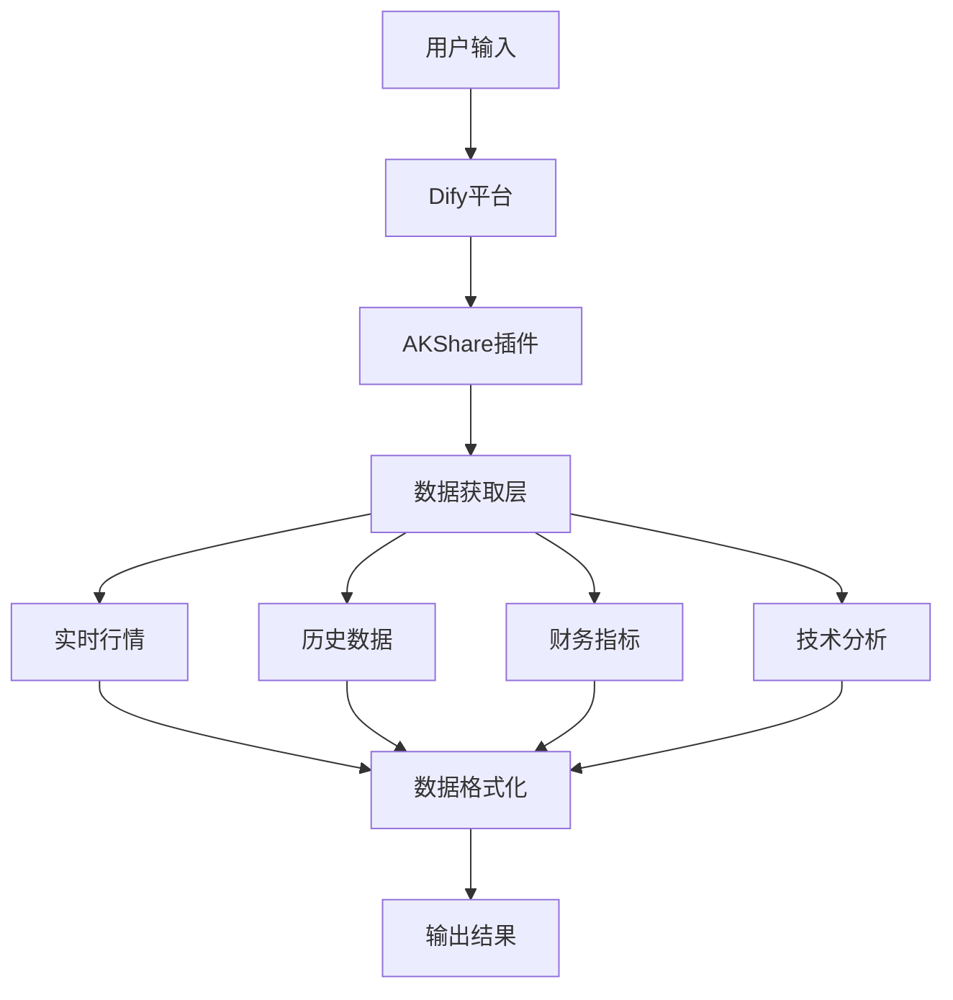

# Dify插件开发实践：构建基于AKShare的股票数据工具

## 项目背景

在Dify应用开发过程中发现，Dify平台缺乏股票数据工具，而AKShare库虽然功能强大但使用门槛较高，需要Python编程知识。因此决定开发一个插件，将AKShare的复杂接口封装为Dify工具节点，降低使用门槛，为Dify用户提供便捷的股票数据获取功能。

## 项目概述

本项目基于开源项目[AKShare](https://github.com/akfamily/akshare)开发了一个Dify平台插件，通过封装AKShare库的113个数据接口，支持多种股票数据的获取和分析，包括实时行情、历史数据、财务指标、资金流向等多个维度，为Dify用户构建基于股票数据的AI应用提供了便利。

### 📋 **插件基本信息**

- **项目名称**：AKShare股票数据插件
- **开发平台**：Dify
- **数据来源**：AKShare开源库
- **接口数量**：113个
- **支持市场**：A股、港股、美股
- **开源协议**：MIT License

### 🎯 **主要功能**

插件提供以下核心功能：
- **数据获取**：支持实时行情、历史数据、财务指标等多种股票数据
- **多市场支持**：覆盖A股、港股、美股等主要市场
- **接口封装**：将AKShare的复杂接口封装为Dify工具节点
- **数据格式化**：自动将数据转换为Markdown表格和JSON格式

## 开发过程

### 技术选型
- **基础库**：选择AKShare作为数据源，因其功能全面且开源免费
- **开发平台**：基于Dify插件开发框架
- **编程语言**：Python 3.12+
- **数据格式**：支持Markdown表格和JSON两种输出格式

### 开发挑战
1. **接口适配**：需要将AKShare的113个接口适配为Dify工具节点
2. **参数处理**：处理不同接口的参数格式和验证
3. **错误处理**：实现完善的错误处理和重试机制
4. **性能优化**：确保插件在Dify环境中的稳定运行

## 🏗️ 技术架构

插件采用以下技术架构：



### 📊 **适用场景**

插件适用于以下使用场景：
- **学习研究**：金融数据分析和学习
- **原型开发**：快速构建股票数据应用原型
- **教学演示**：金融课程和培训演示
- **个人项目**：个人投资研究和分析工具开发

## 📊 数据接口说明

插件提供8大类共113个数据接口，涵盖股票数据的多个维度：

### 🏠 **工具一：股票市场总貌** (13个接口)
- 上交所、深交所市场总貌数据
- 股权质押、商誉数据统计
- 股票账户统计、千股千评
- 新股申购收益率、停复牌提醒、分红派息

### 📊 **工具二：股票实时行情** (17个接口)
- A股市场：沪深京A股实时行情
- 新股数据：新股申购和上市数据
- 对比分析：AH股比价数据
- 国际市场：港股、美股实时行情

### 📈 **工具三：股票历史行情** (9个接口)
- A股数据：日线和分时历史数据
- 国际市场：港股、美股历史数据
- 特色板块：科创板历史数据
- 盘前数据：开盘前的交易数据

### 🏢 **工具四：个股信息总貌** (14个接口)
- 基本信息：A股和港股的股票基本信息
- 行情报价：个股详细行情数据
- 业务分析：主营业务构成分析
- 公司动态：新闻资讯、分红配股、资产负债表

### 💰 **工具五：股票财务数据分析** (14个接口)
- A股财务：业绩快报（利润表、现金流量表、资产负债表）
- 财务指标：同花顺财务指标体系
- 国际对比：港股美股财务数据

### 🌊 **工具六：资金流向分析** (11个接口)
- 个股资金：个股资金流向分析
- 板块资金：板块资金流向排行
- 主力动向：主力资金流向追踪
- 历史分析：行业和概念历史资金流向、筹码分布

### 📊 **工具七：股票技术分析** (18个接口)
- 创新分析：创新高低、连续上涨下跌统计
- 量价分析：持续放量缩量、均线突破、量价分析
- ESG投资：ESG评级数据
- 价值指标：个股技术指标、股息率分析

### 🌉 **工具八：沪深港通持股** (7个接口)
- 成份股：港股通成份股数据
- 实时数据：沪深港通分时数据、实时行情
- 排行数据：板块排行、个股排行
- 持股分析：历史数据、具体股票持股情况

## 🛠️ 安装和使用指南

### 安装方式

插件提供两种安装方式：

#### 方式一：GitHub安装（推荐）

1. **获取插件包**
   - 访问项目GitHub页面：[https://github.com/shaoxing-xie/akshare-stockdata-plugin](https://github.com/shaoxing-xie/akshare-stockdata-plugin)
   - 进入 **releases** 目录
   - 下载 **"AKShare-Stockdata-plugin-v0.5.0.difypkg"** 文件
   - 或者直接点击：[下载插件包](https://github.com/shaoxing-xie/akshare-stockdata-plugin/blob/main/releases/AKShare-Stockdata-plugin-v0.5.0.difypkg)
   - 查看所有版本：[GitHub Releases](https://github.com/shaoxing-xie/akshare-stockdata-plugin/releases)

2. **在Dify中安装**
   - 在Dify工作空间中进入 **工具** → **插件**→  **安装插件**
   -  **安装源**中选择 **"GitHub"**
   - GitHub 仓库，输入：https://github.com/shaoxing-xie/akshare-stockdata-plugin
   - 安装页面中，选择版本号和安装包
   - 点击  **下一步** 、**安装** 按钮

#### 方式二：本地安装

1. **下载源码**
   - 从GitHub仓库克隆或下载源码
   - 确保本地环境已安装Python 3.12+

2. **本地打包**
   - 使用Dify CLI工具打包插件
   - 生成 `.difypkg` 文件

3. **安装插件**
   - 在Dify中上传生成的插件包
   - 完成安装配置

### 配置插件

1. **确认安装成功**
   - 检查插件是否出现在工具列表中
   - 验证插件连接状态

2. **配置参数**
   - 根据需要配置股票代码格式
   - 设置数据输出格式（Markdown/JSON）

### 使用方式

插件提供两种使用方式：

#### 方式一：直接调用工具
在Dify工作流中直接调用插件的工具节点，获取特定类型的股票数据。

#### 方式二：使用演示模板
项目提供了两个演示模板：

**模板一：功能演示**
- 文件名：`AKShare 股票数据插件 CHATFLOW-DEMO.yml`
- 功能：展示8大类工具的使用方法
- 适用：了解插件功能的用户

**模板二：个股分析**
- 文件名：`个股行情分析-ChatFlow.yml`
- 功能：基于插件的个股分析工作流
- 适用：需要个股分析的用户

### 参数配置

插件支持以下参数类型：
- **股票代码**：6位数字代码（如600519）
- **市场类型**：A股、港股、美股等
- **时间范围**：历史数据查询的时间范围
- **数据格式**：Markdown表格或JSON格式

## 📝 使用示例

### 基本使用流程

1. **输入股票信息**：输入股票代码或名称
2. **选择数据接口**：根据需要选择相应的数据接口
3. **获取数据**：插件自动调用AKShare接口获取数据
4. **查看结果**：获得格式化的数据输出

### 示例：获取股票基本信息

**输入参数**：
```json
{
  "interface": "stock_individual_info_em",
  "symbol": "600519"
}
```

**输出结果**：
- 股票基本信息（Markdown表格格式）
- 财务数据摘要
- 公司基本信息

### 示例：获取历史行情数据

**输入参数**：
```json
{
  "interface": "stock_zh_a_hist",
  "symbol": "600519",
  "period": "daily",
  "start_date": "20240101",
  "end_date": "20241231"
}
```

**输出结果**：
- 历史价格数据（日线）
- 成交量数据
- 技术指标数据

## 📚 适用场景

| 用户类型 | 使用场景 | 插件价值 |
|----------|----------|----------|
| **开发者** | 构建股票数据应用 | 提供现成的数据接口 |
| **学生** | 金融课程学习 | 丰富的数据源支持 |
| **研究人员** | 金融数据分析 | 便捷的数据获取方式 |
| **个人用户** | 股票信息查询 | 简单易用的工具 |

## ⚠️ 注意事项

### 使用限制
- 本插件仅供学习和研究使用
- 不构成任何投资建议
- 数据来源为公开信息，仅供参考

### 风险提示
- 投资有风险，决策需谨慎
- 请结合多方信息进行投资决策
- 建议咨询专业投资顾问

## 🔗 相关资源

- **项目地址**：[https://github.com/shaoxing-xie/akshare-stockdata-plugin](https://github.com/shaoxing-xie/akshare-stockdata-plugin)
- **AKShare库**：[https://github.com/akfamily/akshare](https://github.com/akfamily/akshare)
- **Dify平台**：[https://dify.ai](https://dify.ai)
- **问题反馈**：[GitHub Issues](https://github.com/shaoxing-xie/akshare-stockdata-plugin/issues)

## 📄 许可证

本项目采用 MIT 许可证，详情请参阅 [LICENSE](https://github.com/shaoxing-xie/akshare-stockdata-plugin/blob/main/LICENSE) 文件。

---

## 🏷️ 标签

`#Dify插件` `#AKShare` `#股票数据` `#开源项目` `#金融数据`
