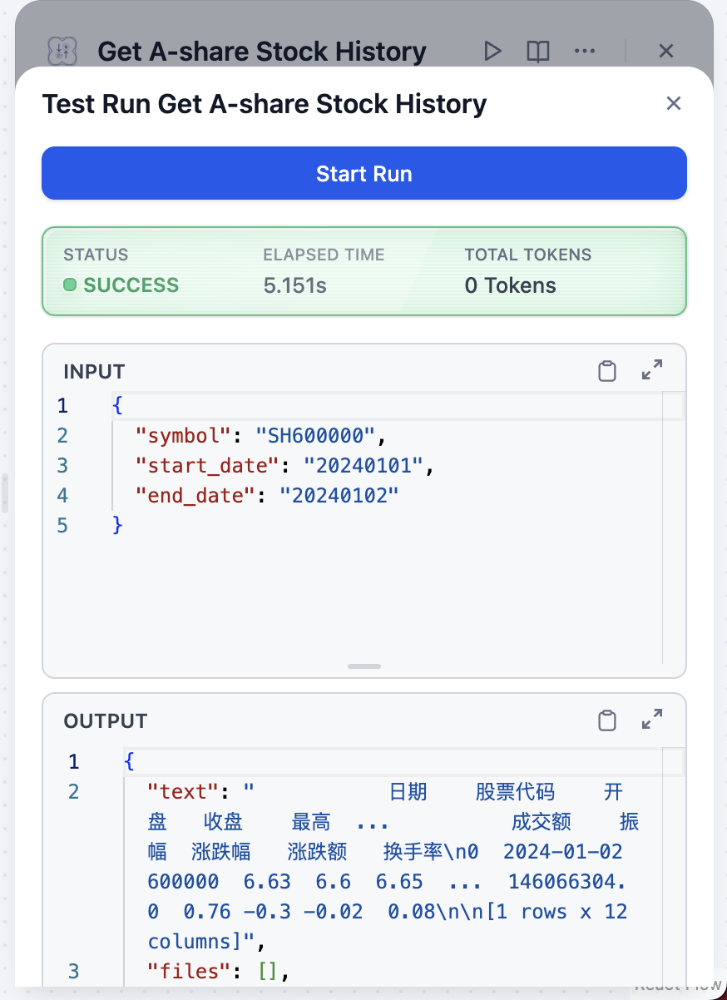
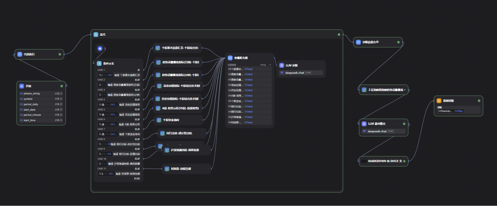

# 应用示例

本目录包含基于AKShare股票数据插件的Dify工作流示例，展示了如何使用插件构建专业的股票分析应用。

## 🎨 应用效果展示

### 📊 个股诊断报告示例

基于插件构建的个股诊断工作流可以自动生成专业的个股诊断报告，包含技术面、基本面、资金面等多维度分析：

上面的报告示例展示了插件生成的完整个股诊断报告，包含：
- **基本信息**: 股票名称、代码、当前价格等
- **技术面分析**: 趋势指标、震荡指标、成交量指标
- **基本面分析**: 财务数据、估值指标、盈利能力
- **资金面分析**: 资金流向、机构持股、主力动向
- **投资建议**: 综合评估和操作建议

### 🔄 工作流配置

以下是个股诊断助手的工作流配置，展示了如何组合使用多个工具来实现复杂的股票分析：

该工作流展示了如何：
- **智能选择工具**: 根据用户需求自动选择合适的分析工具
- **数据集成**: 整合多个数据源的股票信息
- **结果生成**: 自动生成结构化的分析报告

## 📁 文件说明

### 🤖 ChatFlow工作流示例

#### 1. 个股诊断助手.yml ⭐ **推荐**
- **功能**: 完整的个股多维度分析助手
- **特点**: 
  - 技术面、基本面、资金面全面分析
  - 自动生成专业诊断报告
  - 支持股票代码和名称识别
- **状态**: ✅ 兼容v0.6.0版本
- **适用场景**: 深度股票分析、投资决策辅助

#### 2. 个股行情分析-ChatFlow.yml
- **功能**: 个股行情数据分析工作流
- **特点**:
  - 历史行情数据获取
  - 技术指标计算
  - 行情走势分析
- **状态**: ✅ 兼容v0.6.0版本
- **适用场景**: 技术分析、走势判断

### 📚 开发文档

#### 1. Dify插件开发实践：构建基于AKShare的股票数据工具.md
- **内容**: 完整的插件开发实践指南
- **包含**:
  - 插件开发流程
  - 工具配置方法
  - 代码实现示例
  - 调试和测试技巧
- **适用对象**: 开发者、技术人员
- **推荐阅读**: 计划开发自定义股票分析工具的开发者

## 🚀 快速开始

### 方式一：直接使用（最简单）

如果您只想使用现成的应用，可以直接使用"个股诊断助手.yml"：

1. **在Dify中导入工作流**：
   - 登录您的Dify工作空间
   - 进入"工作流"页面
   - 点击"创建应用" → "导入"
   - 上传 `个股诊断助手.yml` 文件

2. **验证插件安装**：
   - 确保AKShare股票数据插件已安装在您的Dify中
   - 工作流会自动识别并配置插件

3. **开始使用**：
   - 直接在对话框中输入股票代码（如：600519）
   - 系统会自动生成完整的个股诊断报告

### 方式二：自定义开发

如果您想构建自己的分析工作流：

1. **参考示例文件**：
   - 研究 `个股诊断助手.yml` 的工作流设计
   - 了解如何使用AKShare插件工具

2. **配置工具参数**：
   - 查看工具的参数说明
   - 根据需求选择合适的接口

3. **测试和优化**：
   - 在Dify中测试工作流
   - 根据实际需求调整参数

## 🎯 功能特点

### 🌟 个股诊断助手核心功能

#### 1. 智能股票识别
- ✅ 支持股票代码输入（如：600519、000001）
- ✅ 支持股票名称搜索
- ✅ 自动识别市场类型（沪市、深市、科创板等）

#### 2. 多维度分析

**技术面分析**：
- 趋势指标：MA5/10/20/30/60、VMA5/10/20
- 震荡指标：RSI6/12/24、KDJ、MACD
- 波动指标：布林带、振幅分析

**基本面分析**：
- 财务数据：利润表、资产负债表、现金流量表
- 估值指标：PE、PB、PCF、PEG
- 业绩评估：业绩快报、业绩预告

**资金面分析**：
- 资金流向：主力资金、机构资金
- 持股情况：十大股东、机构持股
- 市场情绪：资金流入流出、换手率

#### 3. 专业报告生成
- 📊 结构化输出：自动组织分析结果
- 📈 数据可视化：图表和统计数据
- 💡 投资建议：基于多维度数据的综合分析

### 📊 技术指标详细说明

| 指标类别 | 指标名称 | 用途说明 |
|---------|---------|---------|
| **趋势指标** | MA5/10/20/30/60 | 多周期均线，判断趋势方向 |
| **趋势指标** | VMA5/10/20 | 成交量均线，配合价格分析 |
| **震荡指标** | RSI6/12/24 | 相对强弱指标，判断超买超卖 |
| **震荡指标** | KDJ | 随机指标，寻找买卖点 |
| **趋势指标** | MACD | 平滑异同移动平均线 |
| **波动指标** | 布林带 | 价格波动区间分析 |
| **估值指标** | PE/PB/PCF | 市场估值水平评估 |
| **增长指标** | PEG | 成长性估值指标 |

## 🔧 使用指南

### 步骤1：导入工作流

1. 在Dify中创建新的ChatFlow应用
2. 选择"导入工作流"功能
3. 上传对应的YAML文件
4. 等待系统解析和配置

### 步骤2：配置插件依赖

工作流会自动检查所需的插件，包括：
- ✅ **AKShare股票数据插件**（必需）
- ✅ **其他辅助插件**（可选）

### 步骤3：测试运行

1. **准备测试**：
   - 输入测试股票代码（如：000001 平安银行）
   - 点击发送

2. **观察执行**：
   - 查看工作流执行步骤
   - 观察数据获取和处理过程

3. **检查结果**：
   - 验证报告内容完整性
   - 确认数据准确性

### 步骤4：优化调整（可选）

根据您的需求，可以调整：
- **分析深度**: 增加或减少分析维度
- **报告格式**: 自定义报告结构
- **计算参数**: 调整技术指标计算周期

## 💡 使用技巧

### 1. 输入股票代码的最佳实践
- **推荐格式**: 纯数字代码（如：600519、000001）
- **支持格式**: 带市场前缀（如：sh600519、sz000001）
- **避免**: 输入不存在的代码，系统会返回错误提示

### 2. 获取更准确的分析结果
- **提供更多背景**: 说明您的分析目标（如：短期交易、长期投资）
- **指定时间范围**: 明确需要分析的时间区间
- **选择分析重点**: 明确关注技术面、基本面还是资金面

### 3. 理解报告内容
- **技术指标**: 结合多个指标综合判断，避免单一指标误导
- **财务数据**: 关注数据的时效性和连续性
- **投资建议**: 仅作参考，实际投资需谨慎

## 🛠️ 故障排除

### 问题1：工作流导入失败

**可能原因**：
- YAML文件格式错误
- Dify版本不兼容
- 缺少必要的插件

**解决方案**：
1. 检查Dify版本是否为最新
2. 确认AKShare插件已安装
3. 重新下载YAML文件并导入

### 问题2：工具调用失败

**可能原因**：
- 网络连接问题
- 数据源暂时不可用
- 参数配置错误

**解决方案**：
1. 检查网络连接
2. 增加重试次数（在工具配置中）
3. 验证股票代码格式
4. 稍后重试

### 问题3：生成报告不完整

**可能原因**：
- 某些数据接口暂时不可用
- 时间范围过大导致数据量过大

**解决方案**：
1. 缩短分析的日期范围
2. 多次运行获取完整数据
3. 检查网络连接稳定性

## 📞 技术支持

### 获取帮助

如果您在使用过程中遇到问题：

1. **查看文档**：
   - 主README: [插件使用说明](../README.md)
   - 详细文档: [功能文档](../AKShare%20股票数据插件详细功能文档.md)

2. **提交问题**：
   - GitHub Issues: [问题反馈](https://github.com/shaoxing-xie/akshare-stockdata-plugin/issues)
   - 邮件联系: sxxiefg@163.com

3. **社区交流**：
   - 与其他用户交流使用经验
   - 分享您的工作流应用

---

**版本说明**: 本文档中的所有工作流示例已适配v0.6.0版本插件，完全兼容之前版本。

**更新日期**: 2025-10-28
